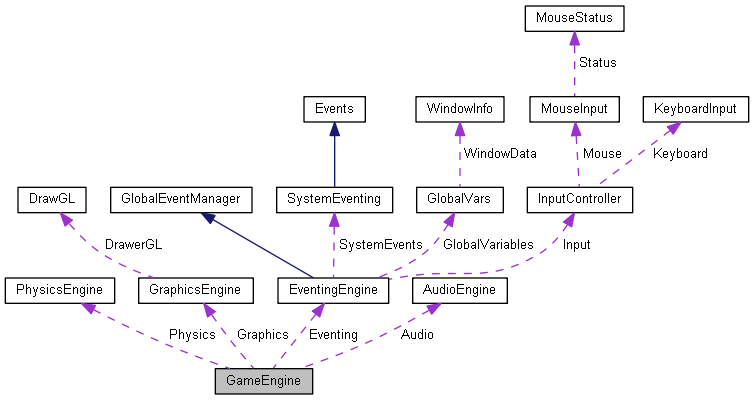
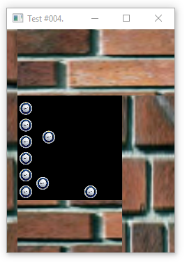
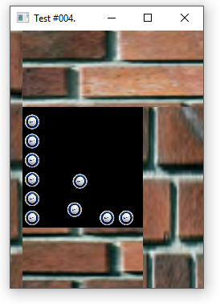
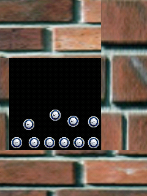
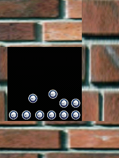

# RushEngine

NOTE: This was my 10th grade shcool project that I'm currently trying to refactor and modernize for fun. A lot of work has to be done to make it a viable game engine for usage outside of test projects.

This is a cross-platform minimal 2D game engine that uses`

* OpenGL for graphics rendering
* Box2D for physics simulation
* SDL for windowing/general purpose APIs
* SDLmixer for audio
* SDLttf for font rendering
* SDLImage for image loading
* Documentation generation via Doxygen

## API scheme`

## TODO Plan

* Rewrite graphics stack with OpenGL 2.0/ES (for mobile).
* Get rid of SDL dependency. For a minimal project like this, SDL is an unnecessary dependency.
* Improve test samples/documentation.
* Port .vsproject files to CMake for easier cross-platform building.

## Some goofy testapp screenshots

Unfortunately graphic design is not the strongest side of the project.

Windows 10`

Android`

## Project structure

* `RushEngine` is the engine source code
* `BallHit` and `TestGame` are different tests for the engine
* `libs` contains SDL/Box2D libraries
* `Docs` contains screenshots and Doxyfile
* `SpaceRush` is planned to be the final, biggest test after the full engine implementation
* `Prebuilt` conatains prebuilt binary files for different libraries/testss
* `ProjectFinal.pdf/.docx` are the project presentation paper (in Armenian, english translation is planned)
